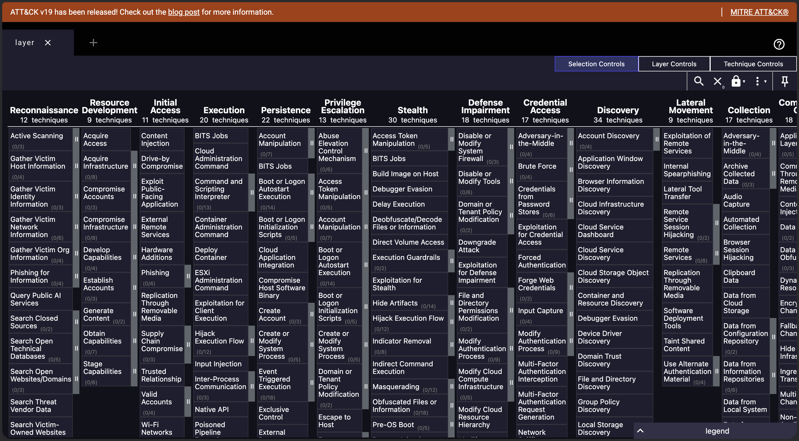
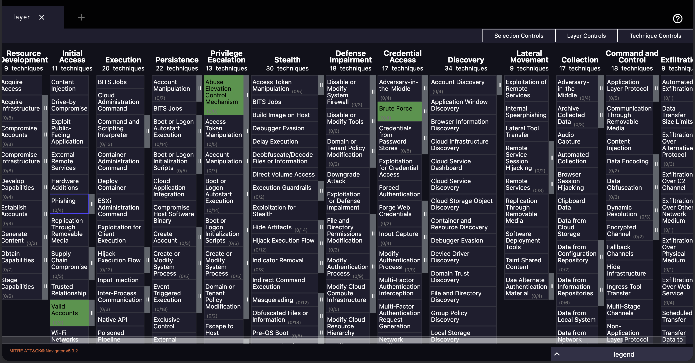
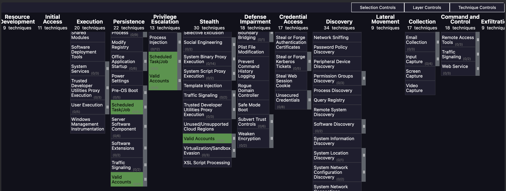
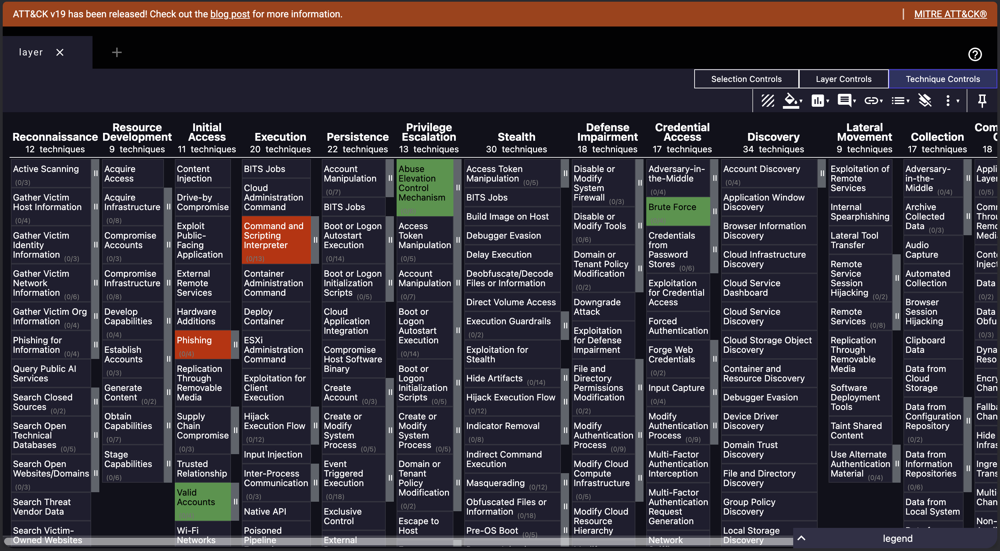
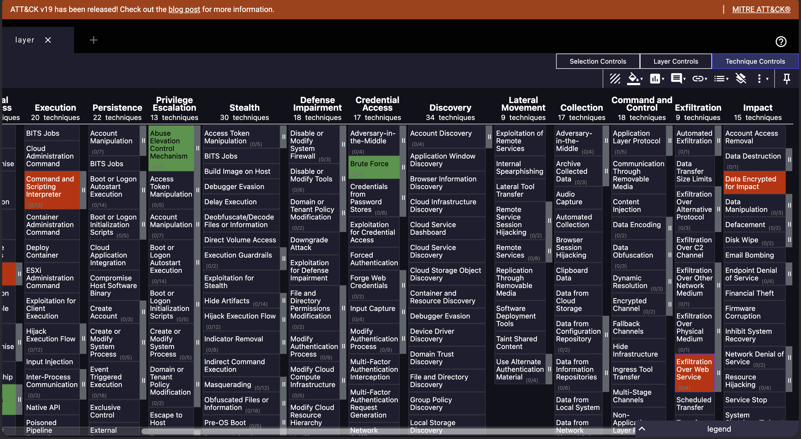

# Day 10 – SOC Tier 1 Incident Report: MITRE ATT&CK Detection Coverage Assessment

---

## Incident Summary

- **Incident Type:** Threat-Informed Defense — Detection Coverage Assessment & Gap Analysis
- **Severity:** High (5 Critical Coverage Gaps Identified)
- **Detection Method:** MITRE ATT&CK Framework Mapping + SOC Detection Inventory + Navigator Visualization
- **Tools Used:** MITRE ATT&CK Navigator, Splunk Enterprise, ATT&CK Framework v14
- **Status:** Assessment Complete — Remediation Roadmap Delivered

---

## Executive Summary

A structured MITRE ATT&CK detection coverage assessment was performed on a home SOC lab environment. Four techniques were confirmed detected via Splunk alert rules built in Day 08, and five critical detection gaps were identified requiring immediate detection engineering work.

The output of this assessment is a Navigator-based coverage map and a prioritized remediation roadmap to guide future detection coverage improvements across the SOC.

---

## Affected System

- **Environment:** Home SOC Lab
- **Detection Stack:** Splunk Enterprise + Universal Forwarder (carried forward from Day 08)
- **Framework Reference:** MITRE ATT&CK Enterprise Matrix v14
- **Visualization Tool:** MITRE ATT&CK Navigator
- **Assessment Output:** Navigator JSON layer (`layer_detection_coverage.json`)

---

## Investigation Methodology

---

### 1. ATT&CK Navigator Baseline



- Initialized a blank ATT&CK Navigator layer as the assessment baseline
- Established the canvas for mapping current and missing detections
- Confirmed Enterprise Matrix scope before applying coverage marking

### SOC Observations:

- A blank Navigator layer is the standard starting point for coverage assessments
- The framework must be reviewed before any detection mapping begins
- Baseline visualization prevents bias toward already known detections

---

### 2. Current Detection Mapping — Initial View



- Marked 4 techniques as actively detected in the SOC environment
- Mapped each detection back to its source Splunk alert rule from Day 08
- Color coded detected techniques in green for visual confirmation

### SOC Observations:

- Detection inventory must reflect operational reality, not aspirational rules
- Each detected technique must be tied to a specific, active alert rule
- Visual confirmation surfaces coverage strengths immediately

---

### 3. Current Detection Mapping — Extended View



- Validated full detection coverage view across the matrix
- Confirmed all four detected techniques rendered correctly in Navigator
- Verified detection mapping aligned with active Splunk SPL rules

### SOC Observations:

- Multi view validation reduces visualization errors before reporting
- Cross matrix confirmation ensures detections are accurately reflected
- Layer integrity is critical for downstream coverage analysis

---

### 4. Coverage Gap Visualization



- Marked 5 critical detection gaps in red across the matrix
- Cross referenced gaps against high prevalence adversary TTPs
- Confirmed gaps span multiple tactics Execution, Initial Access, Impact, Exfiltration

### SOC Observations:

- Gap distribution across multiple tactics indicates strategic blind spots
- High prevalence techniques (PowerShell, Phishing) warrant priority remediation
- Visual gap mapping supports executive-level reporting

---

### 5. Final Coverage Map



- Finalized the unified coverage map showing both detections and gaps
- Exported Navigator layer JSON for archival and version control
- Validated coverage map against Splunk alert inventory

### SOC Observations:

- Combined visualization is the primary deliverable for SOC leadership
- Layer JSON enables versioned tracking of coverage over time
- Re-assessment cadence (e.g. quarterly) is industry standard practice

---

## Detection Coverage Map

| Technique ID | Technique Name                       | Tactic                | Status      |
|--------------|--------------------------------------|-----------------------|-------------|
| T1110        | Brute Force                          | Credential Access     | ✅ Detected |
| T1078        | Valid Accounts                       | Initial Access        | ✅ Detected |
| T1548        | Abuse Elevation Control Mechanism    | Privilege Escalation  | ✅ Detected |
| T1053.003    | Scheduled Task/Job: Cron             | Persistence           | ✅ Detected |
| T1566        | Phishing                             | Initial Access        | ❌ Gap      |
| T1059.001    | PowerShell                           | Execution             | ❌ Gap      |
| T1486        | Data Encrypted for Impact            | Impact                | ❌ Gap      |
| T1567        | Exfiltration Over Web Service        | Exfiltration          | ❌ Gap      |
| T1059        | Command and Scripting Interpreter    | Execution             | ❌ Gap      |

---

## Gap Remediation Roadmap

| Gap                  | Technique ID | Recommended Detection                           |
|----------------------|--------------|-------------------------------------------------|
| Phishing             | T1566        | Email gateway alerts + attachment scanning      |
| PowerShell           | T1059.001    | PowerShell Script Block Logging in Splunk       |
| Ransomware           | T1486        | File integrity monitoring alerts                |
| Exfiltration         | T1567        | Outbound traffic anomaly detection              |
| Script Interpreter   | T1059        | Process creation logging + SPL detection rules  |

---

## Coverage Metrics

| Metric                        | Value                            |
|-------------------------------|----------------------------------|
| Total Techniques Assessed     | 9                                |
| Techniques Detected           | 4                                |
| Detection Coverage Score      | 44%                              |
| Critical Gaps Identified      | 5                                |
| Source of Active Detections   | Splunk Enterprise (Day 08 build) |
| Layer Artifact                | `layer_detection_coverage.json`  |

---

## MITRE ATT&CK Mapping

| Tactic                | Technique                          | ID         | Coverage |
|-----------------------|------------------------------------|------------|----------|
| Credential Access     | Brute Force                        | T1110      | ✅       |
| Initial Access        | Valid Accounts                     | T1078      | ✅       |
| Privilege Escalation  | Abuse Elevation Control Mechanism  | T1548      | ✅       |
| Persistence           | Scheduled Task/Job: Cron           | T1053.003  | ✅       |
| Initial Access        | Phishing                           | T1566      | ❌       |
| Execution             | PowerShell                         | T1059.001  | ❌       |
| Impact                | Data Encrypted for Impact          | T1486      | ❌       |
| Exfiltration          | Exfiltration Over Web Service      | T1567      | ❌       |
| Execution             | Command and Scripting Interpreter  | T1059      | ❌       |

---

## SOC Analyst Findings

- Four techniques confirmed detected through active Splunk alert rules
- Five critical detection gaps identified across Execution, Initial Access, Impact, and Exfiltration
- Coverage concentrated in authentication and persistence not impact or exfiltration
- PowerShell execution monitoring absent despite high attacker prevalence
- No detection capability for ransomware behaviour (T1486) or web based exfiltration (T1567)
- Existing Splunk alerts deliver strong coverage for credential and CRON-based activity

---

## SOC Analyst Response

- Prioritize PowerShell Script Block Logging deployment to close T1059.001 gap
- Implement file integrity monitoring to gain detection capability against ransomware (T1486)
- Deploy outbound traffic anomaly detection to close exfiltration blind spot (T1567)
- Enable email gateway alerting and attachment scanning to detect phishing (T1566)
- Integrate process creation telemetry into Splunk to cover scripting interpreters (T1059)
- Maintain ATT&CK Navigator layer in version control for coverage tracking
- Re-assess detection coverage quarterly to measure improvement velocity

---

## Analyst Insight

A 44% detection rate across the assessed scope is consistent with a small SOC environment building out coverage from foundational authentication monitoring. The most consequential findings are the absence of execution layer detection (PowerShell, scripting interpreters) and the complete lack of impact and exfiltration coverage. An attacker progressing through the kill chain could establish presence undetected through scripting and remove data without triggering a single alert. Closing execution and exfiltration gaps must precede further detection engineering work.

---

## Learning Outcome

This investigation demonstrates the ability to:

- Apply the MITRE ATT&CK Framework to real SOC environments
- Build a Navigator-based detection coverage map
- Calculate quantitative detection coverage scores
- Identify and prioritize detection gaps using threat informed defense principles
- Translate Splunk alert rules into ATT&CK technique coverage
- Produce executive level remediation roadmaps for SOC leadership
- Export and version control ATT&CK Navigator layer artifacts
- Connect offensive technique knowledge with defensive detection capability

---

## Repository Structure

```
mitre-attack-detection-coverage-lab/
├── README.md
├── layer/
│   └── layer_detection_coverage.json
└── screenshots/
    ├── 01_blank_layer.png
    ├── 02_current_detections_1.png
    ├── 02_current_detections_2.png
    ├── 03_coverage_gap_map_1.png
    └── 03_coverage_gap_map_2.png
```

---

## Conclusion

This assessment delivered a structured MITRE ATT&CK detection coverage map for a home SOC lab. Four detections were confirmed active via Splunk, five critical gaps were identified, and a prioritized remediation roadmap was produced. The project demonstrates the ability to think offensively and defensively mapping real attacker techniques against current SOC capability and translating gaps into actionable detection engineering work.
