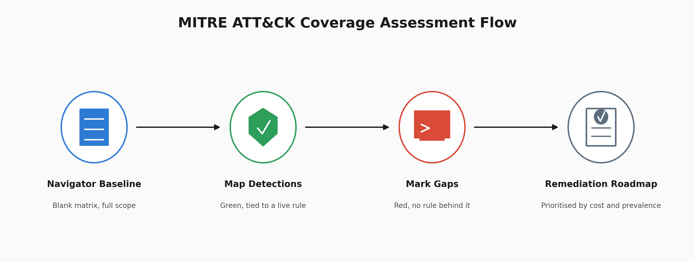
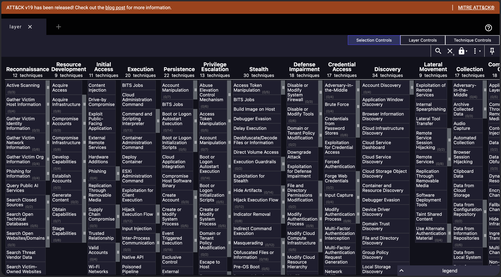
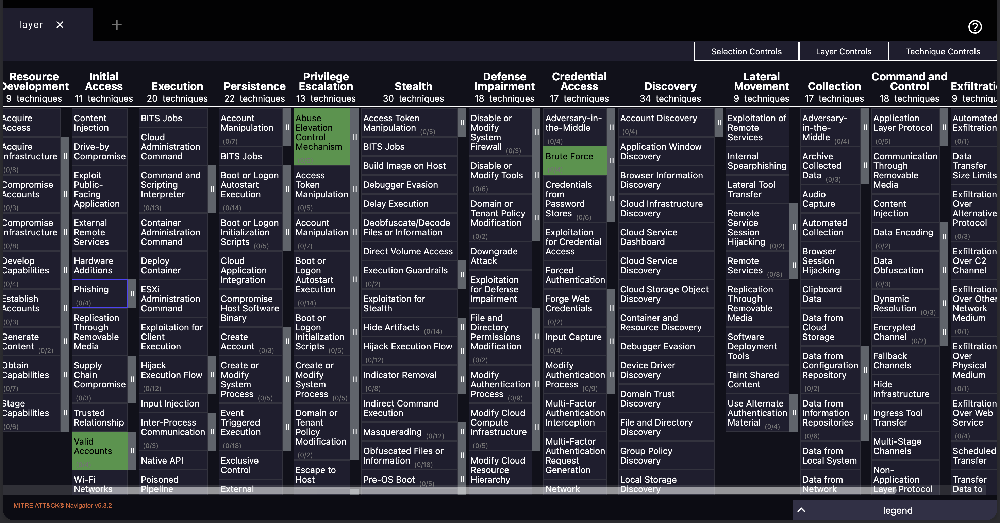
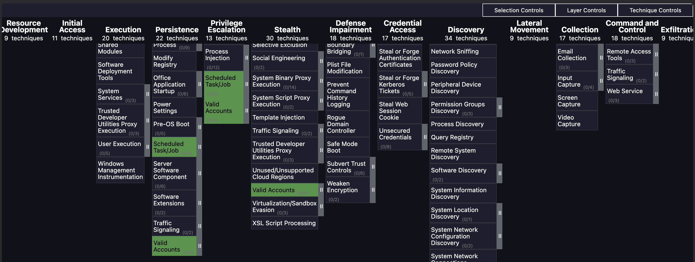
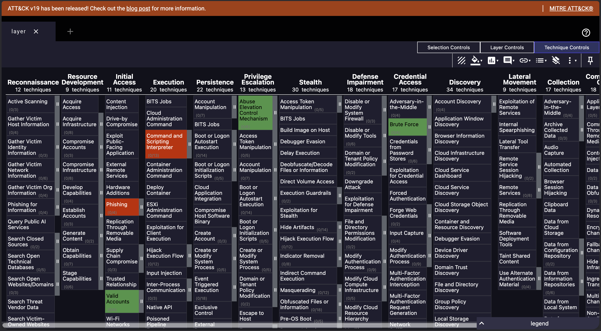
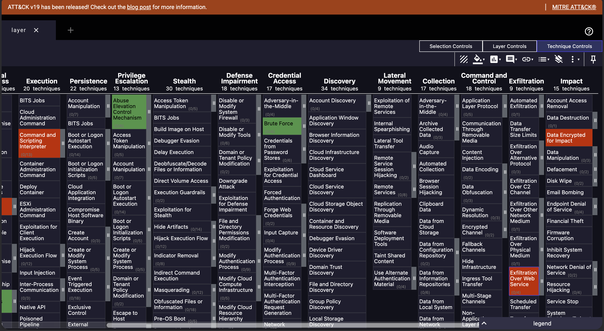

# MITRE ATT&CK Detection Coverage Assessment

I mapped detection and monitoring coverage in my home SOC lab against a deliberately narrow MITRE ATT&CK scope to identify what the lab could see, what still needed stronger detection logic, and where visibility was missing.



**Navigator Baseline → Map Coverage → Validate Evidence → Prioritise Gaps**

This project is a detection coverage assessment, not a claim of coverage across the full ATT&CK Enterprise Matrix.

## At a Glance

| Field | Detail |
| --- | --- |
| Assessment Type | Detection coverage and gap analysis |
| Framework | MITRE ATT&CK Enterprise Matrix v14 at the time of the original assessment |
| Detection Stack | Splunk Enterprise and Universal Forwarder |
| Tools Used | MITRE ATT&CK Navigator, Splunk |
| Scope | 8 techniques reviewed against the lab environment |
| Validation | Existing Splunk rules and available telemetry reviewed against ATT&CK |
| Type | Detection coverage assessment |

## What I Built

I used MITRE ATT&CK Navigator to review where my existing Splunk monitoring aligned with adversary techniques and where meaningful gaps remained.

The original assessment was performed against ATT&CK Enterprise Matrix v14.

ATT&CK has changed since the project was originally completed, so this repository preserves the historical assessment rather than presenting v14 as the current ATT&CK release.

The goal was not to make the largest possible number of ATT&CK cells green.

The goal was to ask a harder question:

**What does the evidence actually justify calling coverage?**

That distinction became important because having telemetry for an activity is not automatically the same as having a reliable detection for malicious use of that activity.

## Assessment Flow

The assessment followed four stages.

| Stage | Purpose |
| --- | --- |
| Navigator Baseline | Start from the ATT&CK matrix rather than only the detections already built |
| Map Coverage | Identify techniques with relevant Splunk rules or telemetry |
| Validate Evidence | Determine what level of coverage the available evidence actually supports |
| Prioritise Gaps | Identify missing visibility and create a remediation roadmap |

Starting from the matrix helped prevent the assessment from becoming a list of things I had already built.

The useful part of a coverage assessment is not only identifying what can be seen.

It is identifying where visibility becomes weak or disappears.

## Navigator Baseline



I started with an ATT&CK Navigator layer before marking the techniques included in the assessment.

The assessment intentionally covered a small subset of ATT&CK.

It should therefore be read as a review of the selected lab scope, not as an overall SOC coverage score.

## Mapping Existing Coverage





The original Navigator assessment marked four areas green based on the Splunk monitoring available in the lab:

* Brute Force
* Valid Accounts
* Abuse Elevation Control Mechanism
* Scheduled Task or Job

Reviewing the project later exposed an important distinction.

A green Navigator cell can show that relevant telemetry or monitoring exists, but that does not automatically prove reliable behavioral detection for the entire ATT&CK technique.

For that reason, the final portfolio assessment separates **stronger detection evidence** from **telemetry or monitoring coverage**.

## Coverage Validation

### T1110, Brute Force

**Coverage classification: Detection coverage**

The lab contains authentication monitoring designed around repeated failed authentication activity.

This directly aligns with the behavior represented by T1110.

### T1078, Valid Accounts

**Coverage classification: Telemetry or monitoring coverage**

Successful authentication activity can be present in the available logs, but successful authentication alone does not identify malicious use of a valid account.

The lab therefore has useful authentication visibility for investigating T1078 scenarios, but I would not describe that evidence alone as a reliable Valid Accounts behavioral detection.

### T1548, Abuse Elevation Control Mechanism

**Coverage classification: Telemetry or monitoring coverage**

The Splunk build monitored sudo related activity.

That provides useful visibility into privilege related activity, but broad sudo monitoring does not prove complete detection coverage for the entire T1548 parent technique.

The original green marking is therefore retained as historical evidence of the assessment while the portfolio conclusion uses the narrower classification.

### T1053.003, Scheduled Task or Job, Cron

**Coverage classification: Monitoring coverage**

The lab explicitly monitored CRON activity.

That gives visibility into activity relevant to T1053.003.

However, observing CRON activity is not automatically equivalent to detecting malicious persistence.

A stronger implementation would distinguish expected scheduled activity from suspicious creation, modification, or execution.

## Gap Visualisation



The original assessment also marked four areas red:

* T1566, Phishing
* T1059, Command and Scripting Interpreter
* T1486, Data Encrypted for Impact
* T1567, Exfiltration Over Web Service

These represent areas where the assessed lab did not have equivalent detection or monitoring coverage during the original project.

## Final Coverage Map



The final Navigator view combines the original green and red markings.

The important lesson is that the colors need context.

**Green does not automatically mean complete detection.**

**Red does not mean the SOC is incapable of investigating the activity if other telemetry exists.**

The map is a starting point for asking what evidence supports each coverage claim.

## Detection Coverage Assessment

| Technique ID | Technique | Original Navigator Status | Final Evidence Based Classification |
| --- | --- | --- | --- |
| T1110 | Brute Force | Green | Detection coverage |
| T1078 | Valid Accounts | Green | Telemetry or monitoring coverage |
| T1548 | Abuse Elevation Control Mechanism | Green | Telemetry or monitoring coverage |
| T1053.003 | Scheduled Task or Job, Cron | Green | Monitoring coverage |
| T1566 | Phishing | Red | Assessed gap |
| T1059 | Command and Scripting Interpreter | Red | Assessed gap |
| T1486 | Data Encrypted for Impact | Red | Assessed gap |
| T1567 | Exfiltration Over Web Service | Red | Assessed gap |

## Coverage Metrics

The original Navigator assessment contained:

| Metric | Value |
| --- | --- |
| Techniques assessed | 8 |
| Original green markings | 4 |
| Original red markings | 4 |
| Original marked coverage ratio | 50 percent |
| Confirmed stronger detection classification after review | 1 |
| Additional monitoring or telemetry coverage | 3 |
| Assessed gaps | 4 |

The original arithmetic was:

**4 green ÷ 8 assessed = 50 percent**

That number describes the original Navigator markings only.

It should **not** be presented as 50 percent detection coverage across ATT&CK or even as proof that all four green techniques have equivalent detection maturity.

The later evidence review showed why a single percentage can hide important differences between telemetry, monitoring, and behavioral detection.

## What the Gaps Actually Mean

The selected scope showed an uneven distribution of visibility.

Authentication and scheduled activity had useful telemetry.

Execution and exfiltration had much weaker coverage within the assessed scope.

That means activity could move beyond the parts of the environment being monitored without equivalent detection logic following it.

The important finding was therefore not simply that four cells were red.

It was that the lab needed better visibility into what happens after access, particularly execution and outbound activity.

## Remediation Roadmap

| Priority | Gap | Technique | Detection to Build |
| --- | --- | --- | --- |
| 1 | Command and scripting activity | T1059 | Add PowerShell Script Block Logging and broader process creation telemetry |
| 2 | Web based exfiltration | T1567 | Develop outbound traffic monitoring and anomaly detection |
| 3 | Ransomware behavior | T1486 | Add appropriate file activity monitoring and detection logic |
| 4 | Phishing | T1566 | Add email security telemetry and detection capability |

Execution was the first remediation priority because improving process and scripting visibility would provide useful evidence across several investigation paths.

At the time of this assessment, PowerShell Script Block Logging was not part of the coverage being assessed.

A later lab implementation added PowerShell Script Block Logging and Event ID 4104 telemetry.

That progression demonstrates why coverage assessments are useful.

A gap can become a concrete engineering task.

## Analyst Findings

The assessment produced several findings:

* Eight ATT&CK techniques were included in the deliberately narrow scope
* Four techniques were originally marked green in Navigator
* Four techniques were originally marked as gaps
* Evidence review showed that the green techniques did not all represent the same level of detection maturity
* T1110 had the strongest direct detection alignment
* T1078 and T1548 had useful telemetry but required stronger behavioral logic before being described as full technique detection
* T1053.003 had explicit CRON monitoring but required additional context to distinguish malicious persistence from normal scheduled activity
* Execution and exfiltration remained important visibility gaps in the original assessment

## Recommended Response

The first improvement would be stronger execution visibility.

PowerShell Script Block Logging can provide Event ID 4104 telemetry for PowerShell activity.

Process creation telemetry can extend visibility to other command and scripting activity.

Outbound network monitoring can improve visibility into potential data transfer and exfiltration behavior.

The ATT&CK Navigator assessment should then be repeated so improvements are measured against the previous state rather than judged from memory.

## What This Lab Demonstrates

This project demonstrates:

* ATT&CK based detection coverage assessment
* Detection gap analysis
* Evidence based coverage classification
* Splunk monitoring review
* ATT&CK Navigator usage
* Detection maturity reasoning
* Remediation prioritisation
* Honest scoping of security metrics

The central lesson is:

**Telemetry is not automatically detection coverage.**

Seeing an event means an analyst has evidence to investigate.

Calling that activity detected requires stronger evidence that the monitoring logic can identify the suspicious behavior being assessed.

## Lessons Learned

The biggest lesson was that a coverage map can create false confidence if every green cell is treated equally.

A Splunk search finding authentication, sudo, or CRON activity proves that relevant telemetry exists.

It does not automatically prove that malicious behavior associated with the entire ATT&CK technique will generate a reliable alert.

I also learned that coverage percentages need their scope attached.

Four green cells out of eight selected techniques produces 50 percent mathematically, but that does not mean the lab detects 50 percent of ATT&CK.

The percentage only describes the markings inside that deliberately narrow assessment.

The final lesson was that parent techniques and subtechniques need careful handling.

Counting both as independent gaps without separately assessing them can distort the result.

## What I Would Improve

I would expand relevant subtechniques in ATT&CK Navigator before marking coverage.

That would allow areas such as command and scripting activity to be assessed at a more precise level rather than relying on a broad parent technique.

I would also define coverage states before beginning the assessment.

For example:

* Confirmed detection coverage
* Monitoring or telemetry coverage
* Gap
* Not assessed

That would prevent a green cell from carrying more meaning than the evidence supports.

I would export and version the Navigator layer during the assessment so future reviews can compare actual artifacts.

Finally, I would rerun the same assessment after implementing remediation work.

That would turn the project from a one time coverage snapshot into a measurable detection engineering cycle.

## Repository Structure

```text
.
├── README.md
└── screenshots/
    ├── 00_architecture.png
    ├── 01_blank_layer.png
    ├── 02_current_detections_1.png
    ├── 02_current_detections_2.png
    ├── 03_coverage_gap_map_1.png
    └── 03_coverage_gap_map_2.png
```

---

## Author

William Gokah

SOC Analyst Portfolio

[](https://linkedin.com/in/WilliamInCyber) [](https://x.com/WilliamInCyber)
